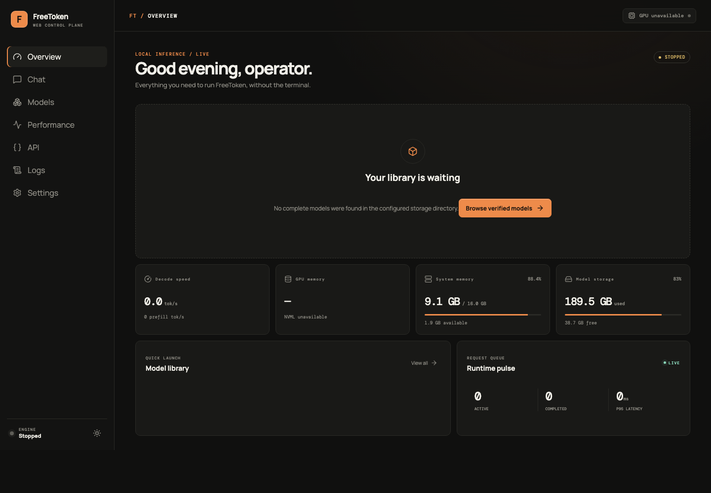
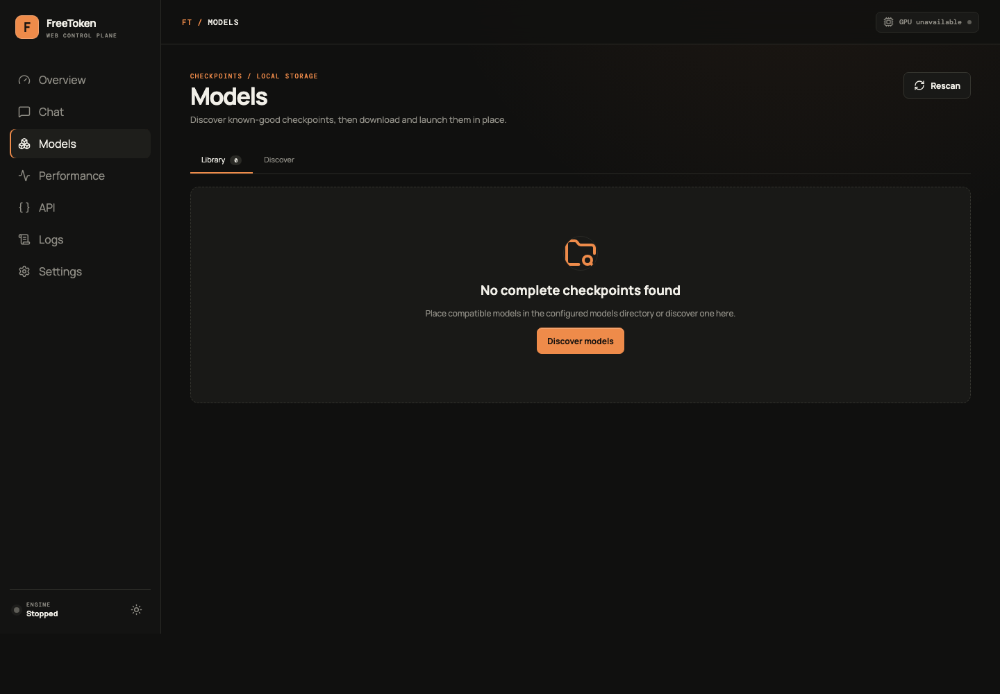
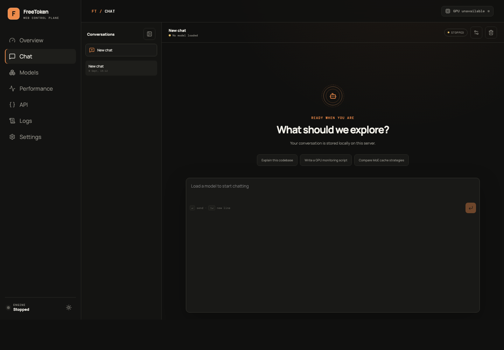

<p align="center">
  
</p>

<h1 align="center">FreeToken Web</h1>

<p align="center">
  A focused, self-hosted control plane for running <a href="https://github.com/FlashML-org/FreeToken">FreeToken</a> without living in the terminal.
</p>

<p align="center">
  <a href="https://github.com/h8ntome/freetoken-webui/actions/workflows/ci.yml"></a>
  <a href="https://github.com/h8ntome/freetoken-webui/actions/workflows/docker-publish.yml"></a>
  <a href="https://github.com/h8ntome/freetoken-webui/releases"></a>
  <a href="LICENSE"></a>
  
</p>

<p align="center">
  <a href="#why-freetoken-web">Why</a> ·
  <a href="#features">Features</a> ·
  <a href="#quick-start">Quick Start</a> ·
  <a href="#configuration">Configuration</a> ·
  <a href="#using-the-api">API</a> ·
  <a href="#troubleshooting">Troubleshooting</a> ·
  <a href="#development">Development</a>
</p>

<p align="center">
  
</p>

## Why FreeToken Web?

[FreeToken](https://github.com/FlashML-org/FreeToken) is the inference engine. FreeToken Web adds the operational layer around it: checkpoint discovery, safe model downloads, exact-process lifecycle management, streaming chat, persistent conversations, runtime telemetry, logs, and copy-ready native API examples.

It does not reimplement inference or place an API-compatibility shim in front of FreeToken. Chat and metrics use FreeToken's native endpoints directly.

## Features

- **One-click model lifecycle** — load, unload, restart, and switch checkpoints in Full Managed Mode.
- **Native model library** — finds complete existing checkpoints and flags missing files or shards.
- **Hugging Face downloads** — live bytes, speed, ETA, cancellation, retry/resume, disk checks, and gated-model token support.
- **Safe destructive actions** — path containment, traversal protection, symlink refusal, and mandatory unload before deletion.
- **Streaming chat** — Markdown, code, reasoning output, generation controls, and locally persisted history.
- **Real telemetry** — FreeToken throughput, latency, request state, cache data, GPU/VRAM, CPU, RAM, and disk.
- **Two deployment modes** — complete local management or a clean frontend for an existing FreeToken server.
- **Deployment-minded security** — optional login, Argon2 password hashing, HttpOnly sessions, CSRF checks, and no Docker socket mount.

<table>
  <tr>
    <td width="50%"></td>
    <td width="50%"></td>
  </tr>
  <tr>
    <td align="center"><sub>Local checkpoint library</sub></td>
    <td align="center"><sub>Persistent streaming chat</sub></td>
  </tr>
</table>

## Quick Start

### Full Managed Mode — recommended

Managed Mode packages FreeToken and the web application together. After the first start, downloading and switching models happens entirely in the UI.

**Requirements:** Ubuntu Linux x86-64, NVIDIA Ampere or newer, driver r580+, Docker Engine with Compose v2, and the [NVIDIA Container Toolkit](https://docs.nvidia.com/datacenter/cloud-native/container-toolkit/latest/install-guide.html).

```bash
git clone https://github.com/h8ntome/freetoken-webui.git
cd freetoken-webui

cp .env.example .env

docker compose up -d
```

Open `http://SERVER_IP:3000`, go to **Models → Discover**, download a supported checkpoint, and select **Load**.

> [!IMPORTANT]
> Authentication is disabled in the example configuration to keep the first launch genuinely one-step. Before exposing the UI beyond a trusted LAN or VPN, set `AUTH_ENABLED=true`, choose a long `ADMIN_PASSWORD`, and restart the container.

### External Mode

Use External Mode when FreeToken already runs elsewhere. Set the address that the container can reach:

```env
FREETOKEN_EXTERNAL_URL=http://host.docker.internal:1919
PUBLIC_API_BASE_URL=http://SERVER_IP:1919
```

Then start the external deployment:

```bash
docker compose -f docker-compose.external.yml up -d
```

Open `http://SERVER_IP:3000`.

> [!NOTE]
> External Mode gives the web interface access to the FreeToken inference API, but it cannot provide the same level of model lifecycle control unless the external FreeToken instance exposes and permits those management capabilities.

External Mode is intended for chat, API information, and monitoring. Download, load, unload, switch, and delete controls are unavailable in both the UI and management API because the web container does not own the remote process or model filesystem. It does not request a local GPU.

## Deployment modes

| Capability | Full Managed Mode | External Mode |
|---|:---:|:---:|
| Chat with the active model | ✓ | ✓ |
| FreeToken metrics and status | ✓ | ✓ |
| Discover existing local checkpoints | ✓ | — |
| Search and download models | ✓ | — |
| Load, unload, restart, and switch | ✓ | — |
| Safely delete unloaded models | ✓ | — |
| Expose native FreeToken APIs | ✓ | Uses the existing endpoint |
| Requires GPU access in the web container | ✓ | — |

The main [`docker-compose.yml`](docker-compose.yml) is the production Managed Mode deployment. [`docker-compose.external.yml`](docker-compose.external.yml) is the GPU-free external client. [`docker-compose.dev.yml`](docker-compose.dev.yml) builds the image locally for development.

## Docker installation

The production Compose files pull:

```text
ghcr.io/h8ntome/freetoken-webui:latest
```

To pin a release, set `IMAGE_TAG=v1.0.0` in `.env`. Images are published for `linux/amd64`, matching FreeToken's supported server platform.

Useful commands:

```bash
# Current status
docker compose ps

# Application and managed FreeToken logs
docker compose logs -f freetoken-web

# Pull and apply an update
docker compose pull
docker compose up -d

# Stop without deleting persistent files
docker compose down
```

The [container publishing workflow](https://github.com/h8ntome/freetoken-webui/actions/workflows/docker-publish.yml) publishes `latest` from `main`, semantic version tags from `v*` Git tags, and immutable commit tags. It uses the repository `GITHUB_TOKEN` with `packages: write`; maintainers should keep Actions workflow permissions enabled and make the GHCR package public for anonymous pulls.

## Configuration

Copy [`.env.example`](.env.example) and change only what your deployment needs.

| Variable | Default | Purpose |
|---|---|---|
| `WEB_PORT` | `3000` | Published web interface port. |
| `WEB_BIND_ADDRESS` | `0.0.0.0` | Host interface for the web port. |
| `FREETOKEN_PORT` | `1919` | Managed native inference API port. |
| `API_BIND_ADDRESS` | `0.0.0.0` | Host interface for the managed inference API. |
| `FREETOKEN_EXTERNAL_URL` | `http://host.docker.internal:1919` | Server-side endpoint used by External Mode. |
| `PUBLIC_API_BASE_URL` | empty | Client-reachable FreeToken URL shown on the API page. |
| `MODELS_PATH` | `./models` | Persistent host model directory. |
| `DATA_PATH` | `./data` | SQLite chats, sessions, jobs, lifecycle state, and logs. |
| `HF_CACHE_PATH` | `./hf-cache` | Persistent Hugging Face cache. |
| `HF_TOKEN` | empty | Optional server-only token for gated/private models. |
| `AUTH_ENABLED` | `false` | Enables management login when `true`. |
| `ADMIN_USERNAME` | `admin` | Management username. |
| `ADMIN_PASSWORD` | empty | Required when authentication is enabled. |
| `SECURE_COOKIES` | `false` | Set `true` when the UI is served over HTTPS. |
| `IMAGE_TAG` | `latest` | GHCR image tag to deploy. |
| `FREETOKEN_EXTRA_ARGS` | empty | Trusted administrator-only flags appended to `ft serve`. |
| `ENGINE_READY_TIMEOUT_SECONDS` | `900` | Maximum managed model startup time. |
| `ENGINE_STOP_TIMEOUT_SECONDS` | `20` | Graceful shutdown window before forced termination. |

`FREETOKEN_EXECUTABLE`, `ALLOWED_IMPORT_DIRS`, and `METRICS_INTERVAL_SECONDS` are advanced direct/development settings. Compose fixes the internal paths and bind host deliberately; configure host storage through the `*_PATH` values above.

## Model management

### Existing models

Place existing checkpoints directly under `MODELS_PATH`. The library scans at startup and refreshes periodically; **Rescan** is available for an immediate check. Recreating or updating the container does not remove bind-mounted models.

A directory is loadable only when it contains either:

- `config.json` (or the model's documented nested configuration) and Safetensors weights, with every indexed shard present; or
- a native FreeToken Weight (`.ftw`) checkpoint produced by `ft checkpoint`.

Incomplete directories remain visible with an actionable issue instead of being presented as ready. Compatibility labels are conservative: **verified** means the exact repository appears in FreeToken's supported model documentation, **likely** is architecture-based, and **unknown** makes no promise.

### Downloading

The native flow is **Search → Download → progress → Library → Load**. Downloads write `.part` files and resume them, check available storage before transfer, reject concurrent duplicates, and keep `HF_TOKEN` on the backend. For a gated model, accept its Hugging Face terms first and add a token with access.

### Loading and deleting

Load state advances through **Starting → Loading → Ready**. Ready is shown only after FreeToken's `/health` endpoint reports `ok`. If another process already owns port `1919`, Managed Mode refuses to replace or kill it and disables lifecycle controls.

Deletion is limited to the configured model root. Absolute paths, `..`, malformed IDs, symlink traversal, and loaded-model deletion are rejected. The confirmation dialog shows the approximate disk space reclaimed; unload a running model as a separate action before deleting it.

## Using chat

Select a ready model and open **Chat**. Responses stream as FreeToken emits them, including supported reasoning content. Conversation history and generation settings are stored in `DATA_PATH`, so they survive image upgrades and container recreation.

## Using the API

Managed Mode publishes FreeToken's native API on port `1919`. The in-app **API** page shows the active model name and copy-ready examples for:

- OpenAI-compatible `POST /v1/chat/completions`
- OpenAI Responses `POST /v1/responses`
- Anthropic-compatible `POST /v1/messages`

Example:

```bash
curl http://SERVER_IP:1919/v1/chat/completions \
  -H 'Content-Type: application/json' \
  -d '{
    "model": "LOADED_MODEL_NAME",
    "messages": [{"role": "user", "content": "Hello"}],
    "stream": true
  }'
```

FreeToken's inference API and FreeToken Web's management API have separate security properties. Restrict port `1919` to trusted clients or protect it with your reverse proxy. Management routes are documented in [`docs/management-api.md`](docs/management-api.md).

## Updating and persistence

```bash
cd freetoken-webui
docker compose pull
docker compose up -d
```

The three managed bind mounts survive container replacement:

- `MODELS_PATH`: downloaded and existing checkpoints
- `DATA_PATH`: chats, settings, sessions, job records, and lifecycle state
- `HF_CACHE_PATH`: Hugging Face cache and resumable transfer data

Back up `MODELS_PATH` and `DATA_PATH` according to their value in `.env`. `docker compose down` stops the application without deleting them.

For External Mode, use the same Compose file that created it:

```bash
docker compose -f docker-compose.external.yml pull
docker compose -f docker-compose.external.yml up -d
```

Its `DATA_PATH` mount preserves chats and application state; model storage remains the responsibility of the external FreeToken deployment.

## GPU and NVIDIA requirements

Managed Mode follows FreeToken's current requirements: Linux x86-64, an NVIDIA Ampere-or-newer GPU, driver r580 or newer, and CUDA 13 support. The image includes the CUDA development toolchain because FreeToken compiles kernels on first use; an initial model load may take substantially longer than subsequent loads.

Verify the deployment environment:

```bash
docker compose exec freetoken-web nvidia-smi
docker compose exec freetoken-web ft --version
curl -fsS http://127.0.0.1:3000/healthz
curl -fsS http://127.0.0.1:1919/health
```

## Reverse proxy and remote access

- Protect both ports with a firewall, trusted LAN, or VPN.
- Enable management authentication before remote exposure.
- Set `SECURE_COOKIES=true` only after HTTPS is working.
- Set `PUBLIC_API_BASE_URL` to the address inference clients can actually reach.
- Do not assume a local listener or router rule proves public reachability; test from outside the network.

No Docker socket is mounted, and the UI cannot execute arbitrary shell commands.

## Troubleshooting

| Symptom | Check |
|---|---|
| Container exits immediately | If `AUTH_ENABLED=true`, `ADMIN_PASSWORD` must be non-empty. Run `docker compose logs freetoken-web`. |
| GPU unavailable | Verify `nvidia-smi` on the host, NVIDIA Container Toolkit, driver r580+, and `docker compose exec freetoken-web nvidia-smi`. |
| Model remains loading | First compilation can be slow. Check Logs, RAM/VRAM, checkpoint completeness, and `ENGINE_READY_TIMEOUT_SECONDS`. |
| Port `1919` already occupied | Stop the unowned server or use External Mode. FreeToken Web deliberately will not kill it. |
| Gated download fails | Accept the model terms on Hugging Face and configure a valid `HF_TOKEN`. |
| Existing model is marked incomplete | Check `config.json`, weight files, and every filename in the Safetensors index. |
| External Mode cannot connect | Test `FREETOKEN_EXTERNAL_URL` from the container and use `host.docker.internal` for a service on the Docker host. |
| API examples show an internal URL | Set `PUBLIC_API_BASE_URL` to the client-reachable address. |

For reproducible bug reports, include the image tag, GPU model, driver version, FreeToken Web logs, and the relevant model repository. Please remove tokens and private URLs before opening an [issue](https://github.com/h8ntome/freetoken-webui/issues).

## Development

Build the application image locally:

```bash
cp .env.example .env
docker compose -f docker-compose.dev.yml up -d --build
```

Run the test suites directly:

```bash
python3 -m venv .venv
.venv/bin/pip install -r backend/requirements-dev.txt
(cd backend && ../.venv/bin/pytest -q)

(cd frontend && npm ci && npm test && npm run build)
```

The frontend is React, TypeScript, and Vite. The backend is FastAPI with SQLite. Keep lifecycle operations argv-based, preserve model-path containment, and add regression coverage for behavior changes.

## Contributing

Issues and focused pull requests are welcome at [github.com/h8ntome/freetoken-webui](https://github.com/h8ntome/freetoken-webui). Before submitting a change:

1. Explain the operational problem and affected deployment mode.
2. Keep unrelated UI and architecture changes out of the patch.
3. Run both backend and frontend test suites.
4. Document any new environment variable or persistent path.

## License

FreeToken Web is licensed under the [Apache License 2.0](LICENSE).

## Acknowledgements

- [FlashML-org/FreeToken](https://github.com/FlashML-org/FreeToken) provides the inference runtime and native APIs.
- [Hugging Face Hub](https://huggingface.co/) provides model discovery and checkpoint hosting.
- The CUDA runtime image is distributed by [NVIDIA](https://catalog.ngc.nvidia.com/orgs/nvidia/containers/cuda).

FreeToken Web is an independent community control plane and is not a replacement for FreeToken's own documentation, compatibility guidance, or licensing terms.
